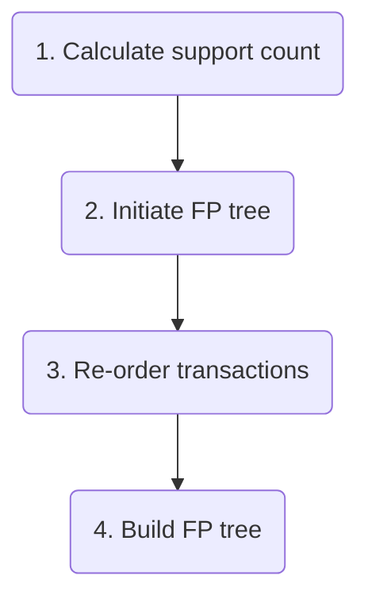
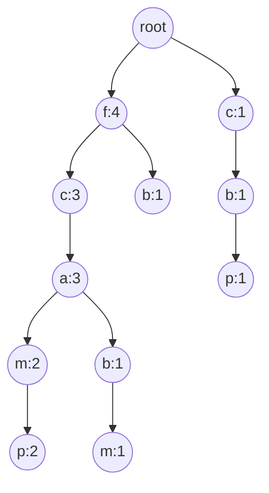
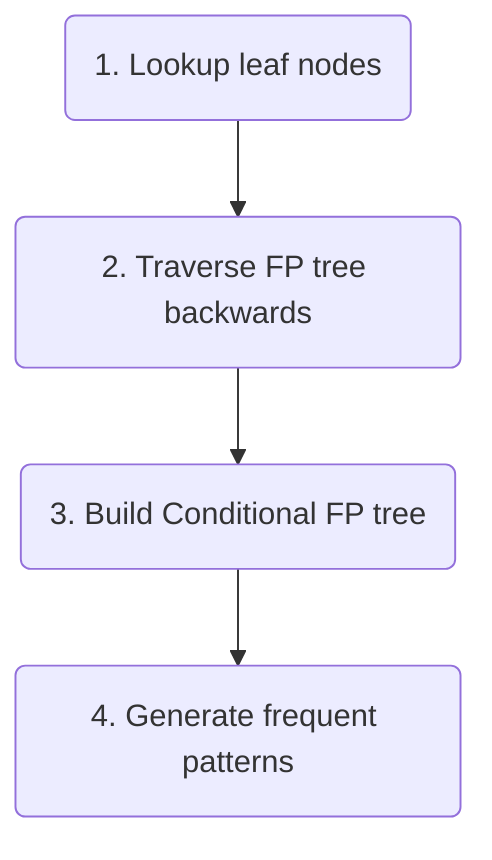

# FPGrowth

> **Please note!** This Markdown document uses both math syntax and mermaid diagrams, so it will not render correctly on GitHub. Have look at the PDF file instead.

Julia implementation of the FP Growth algorithm from Han, Pei and Yin: [Mining Frequent Patterns without Candidate Generation](https://www.cs.sfu.ca/~jpei/publications/sigmod00.pdf).

Watch [Chapter-7 : FP Growth method with an example](https://www.youtube.com/watch?v=VB8KWm8MXss) for a walk-through of the algorithm and [Chapter-9 : Association rule mining with FP Growth method](https://www.youtube.com/watch?v=ToswH_dA7KU) for a walk-through of how to mine the rules.

## Introduction to FP Growth

We need two algorithms for FP Growth. One to build the tree and another to mine the rules.

### Build the tree

The typical implementation expects a minimum support to be provided. In the original paper this is denoted as $\xi$. The algorithm should allow for the threshold to be supplied both as a count and a percentage. The suggestion is to use $\xi$ to eliminate items that do not meet the threshold before the tree building starts. This is done by organising the transactions by descending $\xi_{item}$ and remove those below the threshold.

$$
min\_count = \xi \times n
$$

$$
\xi = \frac{min\_count}{n}
$$

The result should be a list of all items that meet the minimal threshold of $\xi$ and have been sorted in descending order. **TBD** is whether the transactions should be re-ordered and filtered at this stage too. 

To build the FP tree, start at the root node. Consider using the tree as the root node and thus avoid searching the nodes for the root. Then scan the transactions in order.

For each transaction (assuming it has been ordered), start with the first item and look for it among the *children* of root node. If it is present, move to the relevant node while increasing its count. If not present, create the node while setting the count to 1.

Continue looping through the items in the transaction, while applying the same logic (i.e. look for the item in the *children* and either increase the count of an existing match or create a new.)

**Important!** To facilitate the subsequent mining, the *siblings* part of the tree will be kept up-to-date whenever a new node is added. This is called the *frequent item header table*.

Example from the original paper

The nodes in the tree all have the same information: *Label*, *count* and *node-link*. In the original paper, only the first node to have a particular label will get recorded in the frequent item header table. The node-link information will take care of the linking. **TDB** consider if this is efficient design.

This setup would suggest having one set of functions that read, convert and transform the transactions and another that builds the tree and the table (stored on the tree).

### Mine the rules

To mine the rules start at the bottom of the *frequent item header table* (i.e start at the leaf nodes).

Use this link to get the powerset in julia: [all subset of a se in julia - Stack Overflow](https://stackoverflow.com/questions/54052333/all-subset-of-a-se-in-julia)

## Notation

Throughout this document the following notation is used.

| symbol        | meaning                   | notes                                                                                                                                                                                                                                                                 |
| -------------:| ------------------------- | --------------------------------------------------------------------------------------------------------------------------------------------------------------------------------------------------------------------------------------------------------------------- |
| $\xi$         | minimum support threshold | The notation was chosen to reflect the notation in the orignal paper.                                                                                                                                                                                                 |
| $\varnothing$ | empty set                 | { }                                                                                                                                                                                                                                                                   |
| $\mathcal{P}$ | powerset                  | $\mathcal{P}(T)$ denotes the power set of $T$. E.g. the power set of $\mathcal{P}(\{1,2,3\}) = \{\ \varnothing, \{1\}, \{2\}, \{3\}, \{1, 2\}, \{1,3\}, \{2,3\}, \{1,2,3\}\}$. We will use this for the discovery of rules when we move from leaf nodes to root node. |
|               |                           |                                                                                                                                                                                                                                                                       |
|               |                           |                                                                                                                                                                                                                                                                       |
